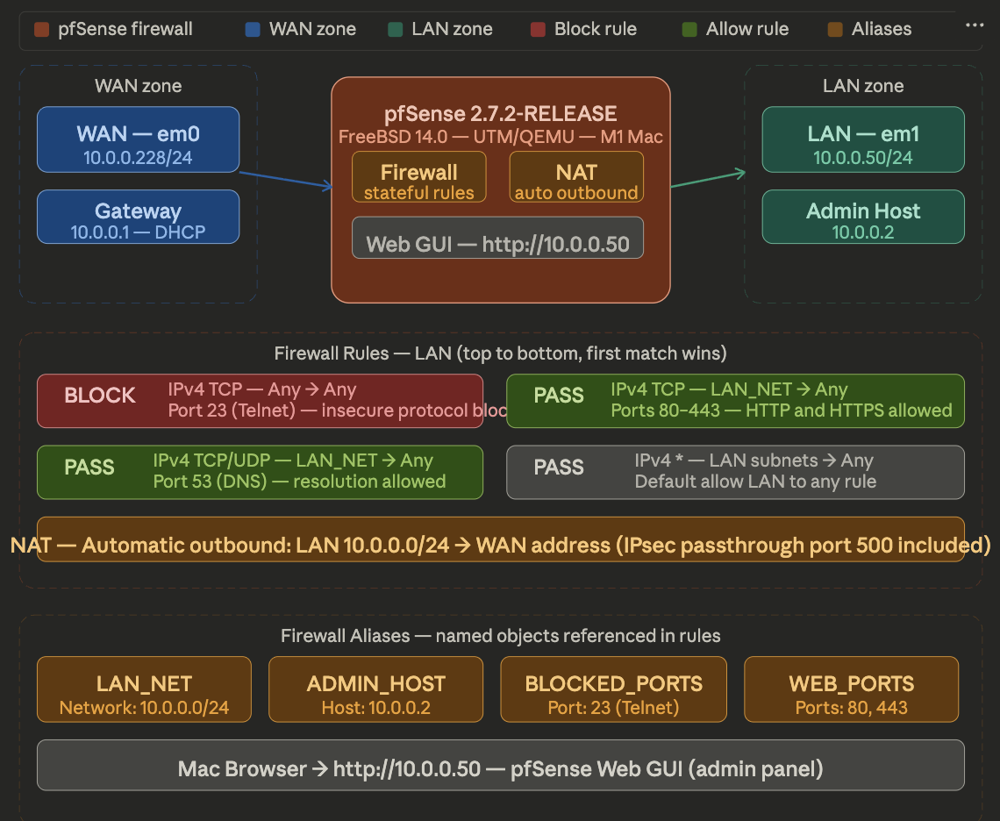

# Firewall Lab — pfSense 2.7.2 CE

> Deployed pfSense 2.7.2-RELEASE as a full-featured enterprise firewall using UTM
> (QEMU emulation) on macOS Apple Silicon — configuring WAN/LAN zones, firewall
> rules with named aliases, outbound NAT, and traffic filtering policies.

📄 **[View Full Lab Documentation (PDF)](./pfSense_Firewall_Lab_Documentation.pdf)**




---

## Objective

Deploy and configure pfSense as a perimeter firewall — implementing zone-based
traffic control, named alias objects, stateful firewall rules, and NAT to simulate
real enterprise firewall deployments comparable to Fortinet and Cisco ASA.

---

## Environment

| Component | Details |
|-----------|---------|
| Firewall OS | pfSense 2.7.2-RELEASE (amd64) |
| Underlying OS | FreeBSD 14.0-CURRENT |
| Hypervisor | UTM (QEMU emulation) on macOS Apple Silicon M1 |
| CPU (emulated) | Intel Core Skylake — 2 vCPUs |
| WAN Interface | em0 — 10.0.0.228/24 — DHCP |
| LAN Interface | em1 — 10.0.0.50/24 — Static |
| Web GUI | http://10.0.0.50 |
| NAT Mode | Automatic outbound NAT |

---

## What Was Configured

### Firewall Aliases

| Alias | Type | Value | Purpose |
|-------|------|-------|---------|
| LAN_NET | Network | 10.0.0.0/24 | LAN network range |
| ADMIN_HOST | Host | 10.0.0.2 | Admin workstation |
| BLOCKED_PORTS | Port | 23 | Telnet — insecure |
| WEB_PORTS | Port | 80, 443 | HTTP and HTTPS |

### Firewall Rules — LAN Interface

| Action | Protocol | Source | Port | Description |
|--------|----------|--------|------|-------------|
| BLOCK | IPv4 TCP | Any | 23 | Block Telnet |
| PASS | IPv4 TCP | LAN_NET | 80-443 | Allow web traffic |
| PASS | IPv4 TCP/UDP | LAN_NET | 53 | Allow DNS |
| PASS | IPv4 * | LAN subnets | Any | Default allow LAN |

### NAT — Outbound
- Mode: **Automatic outbound NAT**
- Auto rule: LAN → WAN address (all ports)
- Auto rule: ISAKMP passthrough (port 500)

---

## Verification Screenshots

| Screenshot | What It Proves |
|-----------|---------------|
| `dashboard.png` | pfSense 2.7.2 running — system info, uptime |
| `aliases.png` | All aliases configured — LAN_NET, ADMIN_HOST, BLOCKED_PORTS |
| `fw_rules.png` | Firewall rules active — Block Telnet, Allow Web, Allow DNS |
| `nat.png` | Automatic outbound NAT — auto rules generated |
| `interfaces.png` | WAN and LAN both up — IPs confirmed |

---

## Key Concepts Demonstrated

```
WAN (10.0.0.228)  ←──→  pfSense Firewall  ←──→  LAN (10.0.0.50)
                              │
                    Firewall Rules:
                    - Block Telnet (port 23)
                    - Allow HTTP/HTTPS (80/443)
                    - Allow DNS (port 53)
                    NAT:
                    - Auto outbound NAT
                    - ISAKMP passthrough
```

---

## Troubleshooting Log

| Issue | Resolution |
|-------|-----------|
| pfSense ISO download | Used direct Netgate mirror: atxfiles.netgate.com/mirror/downloads/ |
| ISO extraction failed | Used Terminal gunzip instead of macOS Archive Utility |
| UEFI boot loop | Unchecked UEFI Boot in UTM tweaks — switched to SeaBIOS |
| Disk not detected in ZFS | Changed drive interface from VirtIO to IDE in UTM |
| Web GUI unreachable | Changed LAN to Bridged adapter, set static IP 10.0.0.50 |
| Package manager offline | Known QEMU bridged networking limitation on Apple Silicon |

---

## Skills Demonstrated

- pfSense firewall deployment and configuration
- Zone-based network security (WAN/LAN separation)
- Stateful firewall rules — block, pass, protocol filtering
- Named alias objects for clean rule management
- Automatic outbound NAT and IPsec passthrough
- FreeBSD/QEMU troubleshooting on Apple Silicon
- Enterprise firewall concepts (comparable to Fortinet/Cisco ASA)

---

## Part of My IT Portfolio

| Project | Repo |
|---------|------|
| Project 1 — VLAN & Inter-VLAN Routing | [vlan-intervlan-routing-lab](https://github.com/Daksh2601/vlan-intervlan-routing-lab) |
| Project 2 — DNS & DHCP Server on Linux | [dns-dhcp-linux-lab](https://github.com/Daksh2601/dns-dhcp-linux-lab) |
| Project 3 — Active Directory Home Lab | [active-directory-lab](https://github.com/Daksh2601/active-directory-lab) |
| Project 4 — Site-to-Site VPN | [site-to-site-vpn-lab](https://github.com/Daksh2601/site-to-site-vpn-lab) |
| Project 5 — Network Monitoring with Zabbix | [network-monitoring-zabbix-lab](https://github.com/Daksh2601/network-monitoring-zabbix-lab) |
| Project 6 — Firewall Lab with pfSense (this repo) | [pfsense-firewall-lab](https://github.com/Daksh2601/Pfsense-firewall-lab)|

*Daksh Patel · CCNA Certified · [LinkedIn](https://www.linkedin.com/in/pateldaksh)*
